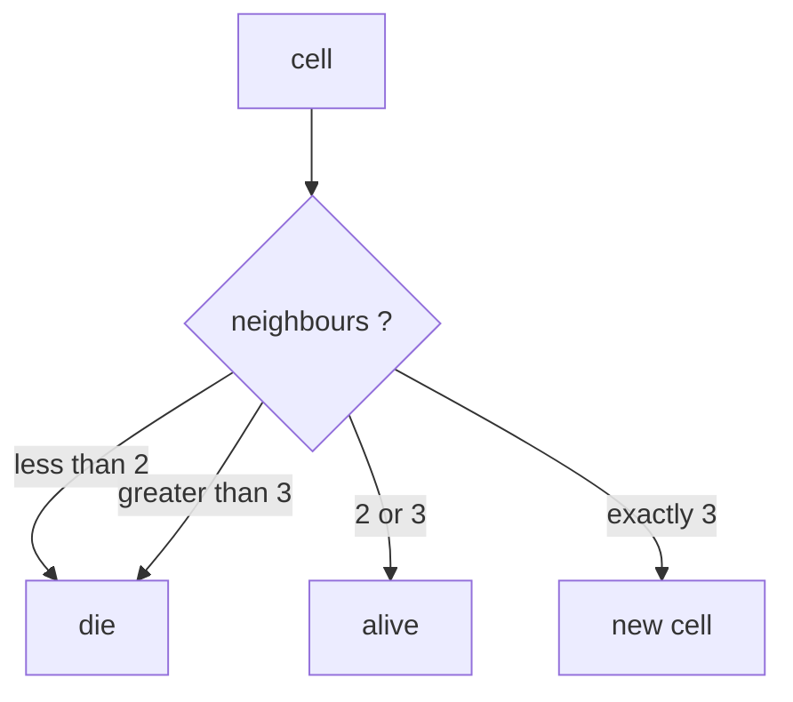

# game-of-life

agrs (optional):
```<file> <width> <height>```


```mermaid
graph TD
  a[cell]
  a-->b{neighbours ?}
  b--less than 2--> die
  b--2 or 3-->alive
  b--greater than 3-->die
  b--exactly 3-->c[new cell]
```
